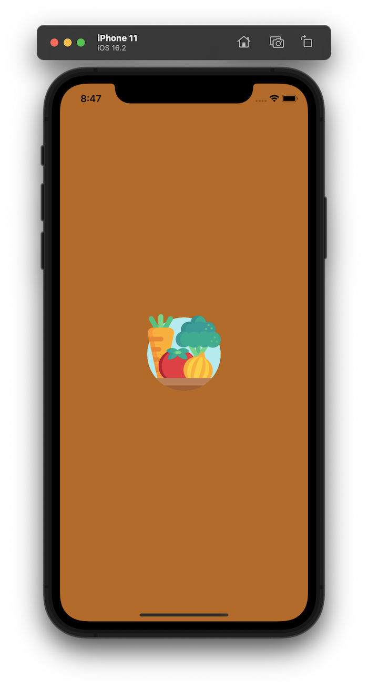

# Flutter mockup of the Agile Garden Club app

This repository contains the third increment of work on a mockup of the [Agile Garden Club](https://agilegardenclub.com) application. 

The main changes in this version are:

* The use of Riverpod for state management. The data model entities are now accessed using Providers.
* The ability to add and edit garden data using the Add Garden and Edit Garden pages. 

## Screen shots 

Here are screen shots that illustrate current application state. We use the flutter_markdown package to provide information on what should appear in a page when we haven't gotten around to actually mocking up the contents.   

Click on any screen shot to see it full-size.

### Splash, signin, and signup pages:

  
&nbsp; &nbsp; 
  
&nbsp; &nbsp; 
  

### Home page: My News, My Gardens, My Discussions

  
&nbsp; &nbsp; 
  
&nbsp; &nbsp; 
  

### Navigation Drawer, Gardens, and Chapters pages

  
&nbsp; &nbsp; 
  
&nbsp; &nbsp; 
  

### Add Garden and Edit Garden

  
&nbsp; &nbsp; 
  

### Outcomes, Seeds, Members pages

  
&nbsp; &nbsp; 
  
&nbsp; &nbsp; 
  

### Discussions page

  

### Help

  
&nbsp; &nbsp; 
  

## Installation

This app can only be run locally in development mode. To install and run:

* Clone this repository to your computer.
* Bring up an IDE such as IntelliJ on the repository.
* Run the app within a simulator. 

## DartDoc

Unfortunately, `dart doc` does not yet provide useful documentation for this mockup, since almost all of the code resides in the `src` directory.  This should be addressed soon, see <https://github.com/dart-lang/dartdoc/issues/3096>.
